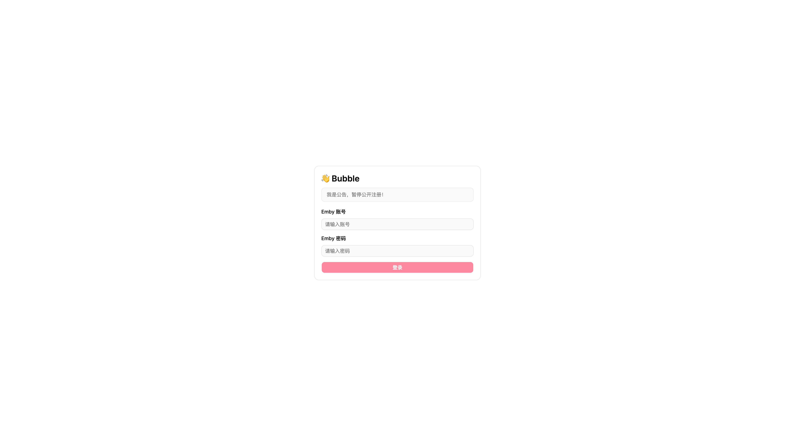
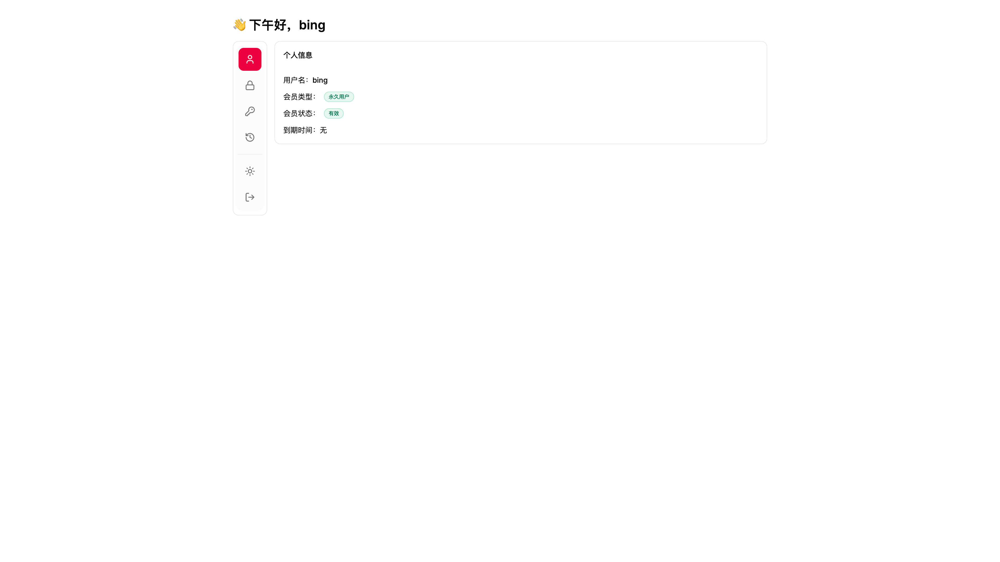
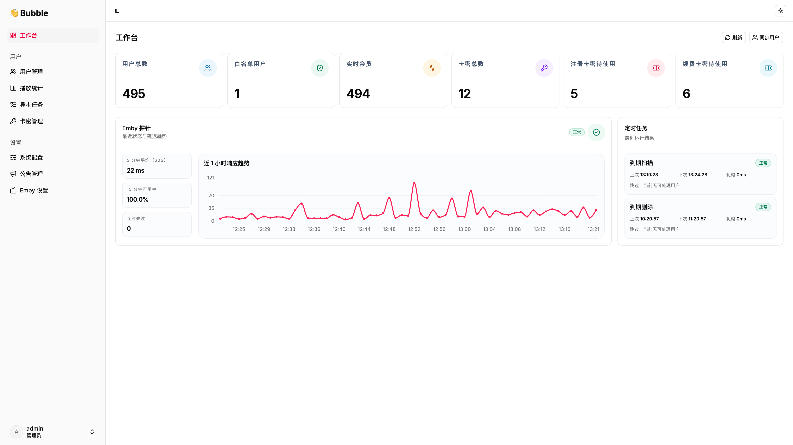
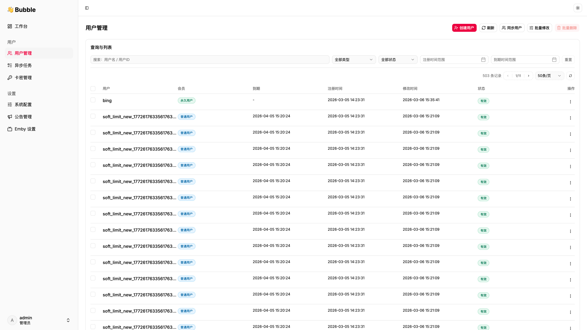
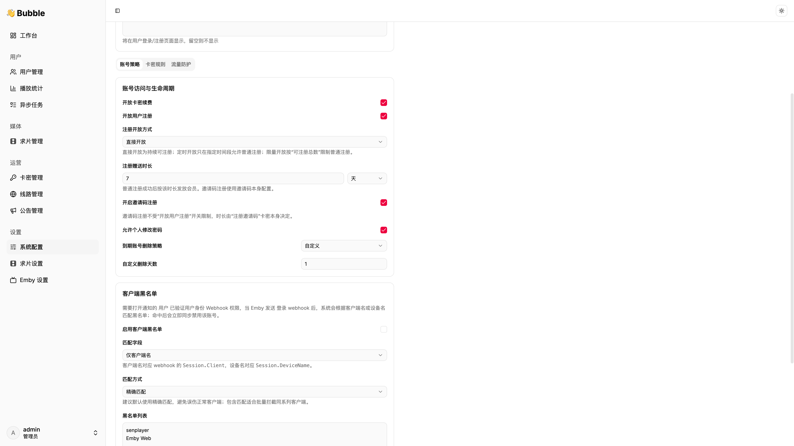
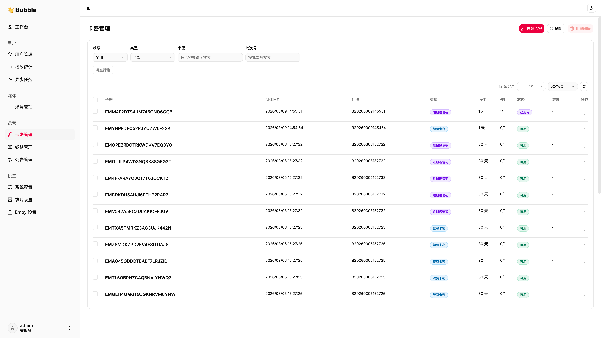
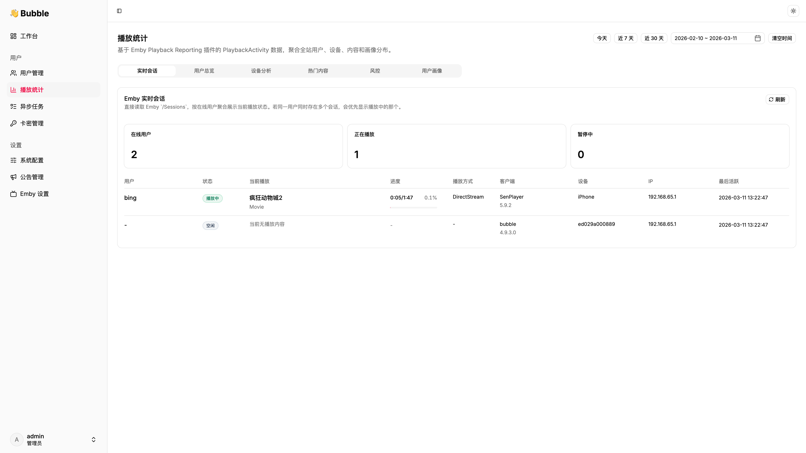
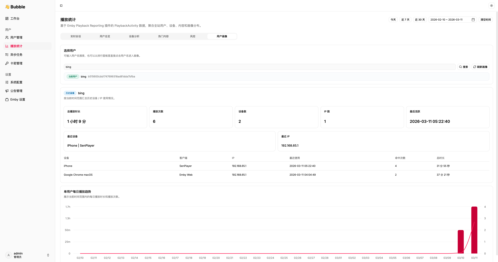
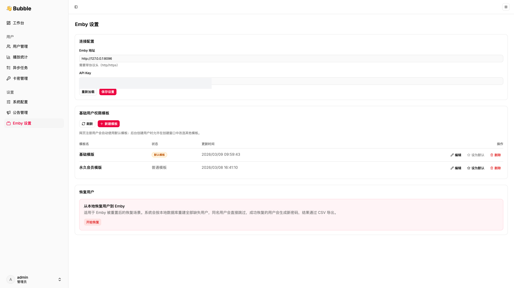

<div align="center">
  <h1>Bubble Emby Admin</h1>
  <p>面向 Emby 管理场景的后台系统</p>
</div>

<p align="center">
  <a href="#intro"></a>
  <a href="#roadmap"></a>
  <a href="#preview"></a>
  <a href="#image"></a>
  <a href="#deploy"></a>
  <a href="#install"></a>
  <a href="#upgrade"></a>
  <a href="#changelog"></a>
</p>

<a id="intro"></a>
## ✨ 介绍

- 👥 用户管理能力
  - 同步用户
  - 批量续费
  - 批量删除
  - 批量禁用
  - 白名单启用与关闭

- 🎫 卡密系统
  - 支持自定义天数卡密
  - 注册卡密
  - 续费卡密

- 📝 注册能力
  - 公开注册
  - 限时注册
  - 限量注册
  - 邀请码注册
  - 注册赠送时长配置

- 📢 公告系统
  - 普通公告
  - 重要公告

- ⚙️ 系统配置
  - Emby 服务配置
  - 站点名称配置
  - 登录提示配置
  - 注册规则配置
  - 兑换规则配置

- 📺 播放统计
  - 用户详情播放统计
  - 全站播放统计
  - Emby 实时会话
  - 热门内容排行
  - 设备分析与客户端分布
  - 基础风控与用户画像

<a id="roadmap"></a>
## 🛠️ 开发计划

### 已完成

- [x] 用户管理主流程
- [x] 异步任务
- [x] 卡密系统
- [x] 注册与公告系统
- [x] 用户权限能力
  - 用户权限配置
  - 基础用户权限模板
  - 权限模板批量同步
- [x] Emby 管理增强
  - Emby 简易探针
  - Emby 设置页
  - 从本地恢复用户到 Emby
- [x] 播放统计
  - 用户播放时长汇总
  - 用户播放记录
  - 用户设备 / IP 画像
  - Emby `/Sessions` 实时会话看板
  - 全站播放时长排行
  - 用户 IP / 设备数量排行
  - 全站设备使用排行
  - 客户端占比与设备分布占比
  - 热门影片 / 热门剧集排行
  - 多 IP / 多设备 / 高频切换风控排行
  - 用户画像

### 开发中 / 待规划
- [ ] 正在开发中...

 
<a id="preview"></a>
## 🖼️ 界面预览

<details>
  <summary>点击展开界面预览</summary>
  <br />
  <p>
    
    
  </p>
  <p>
    
    
  </p>
  <p>
    
    
  </p>
  <p>
    
    
  </p>
  <p>
    
  </p>
</details>

<a id="image"></a>
## 📦 镜像信息

- 镜像地址：`bubbleemby/bubble-emby-admin:latest`
- 默认端口：`8668`
- 容器内配置路径：`/app/configs/config.yaml`
- 默认时区：`Asia/Shanghai`

<a id="deploy"></a>
## 🚀 部署方式

项目提供两种 Compose 文件，分别对应不同的数据库使用场景。

### 方式一：使用内置 MySQL

适用于没有现成数据库，希望直接启动完整环境的场景。

使用文件：`docker-compose.mysql.yml`

```bash
docker compose -f docker-compose.mysql.yml up -d
```

访问地址：

```text
http://服务器IP:8668
```

### 方式二：使用外部 MySQL

适用于已有数据库实例，希望只部署应用容器的场景。

使用文件：`docker-compose.yml`

```bash
docker compose -f docker-compose.yml up -d
```

访问地址：

```text
http://服务器IP:8668
```

首次安装时，请在安装页面填写实际数据库连接信息。

常见填写方式：

- 数据库与应用部署在同一台宿主机：`host.docker.internal` 或宿主机实际 IP
- 数据库部署在独立服务器：数据库服务器 IP 或域名
- 数据库部署在同一 Docker 网络中的其他容器：对应服务名或容器名

<a id="install"></a>
## 🔧 安装

首次启动后，应用日志会输出一次性安装口令。可通过以下命令查看：

```bash
docker logs -f bubble-emby-admin
```
访问地址：``` http://服务器IP:8668/install ``` 进行安装。
后台管理地址：``` http://服务器IP:8668/admin/login ``` 


<a id="upgrade"></a>
## ⬆️ 升级

拉取新镜像后，重新创建容器即可完成升级：

```bash
docker pull bubbleemby/bubble-emby-admin:latest
docker compose -f docker-compose.mysql.yml up -d
```

如果当前使用的是外部数据库版本，请将命令中的 Compose 文件替换为 `docker-compose.yml`。

<a id="changelog"></a>
## 📝 更新日志

详细变更记录见：[CHANGELOG.md](./CHANGELOG.md)
